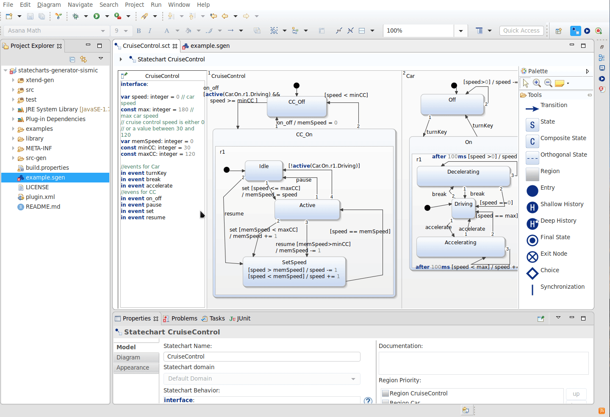
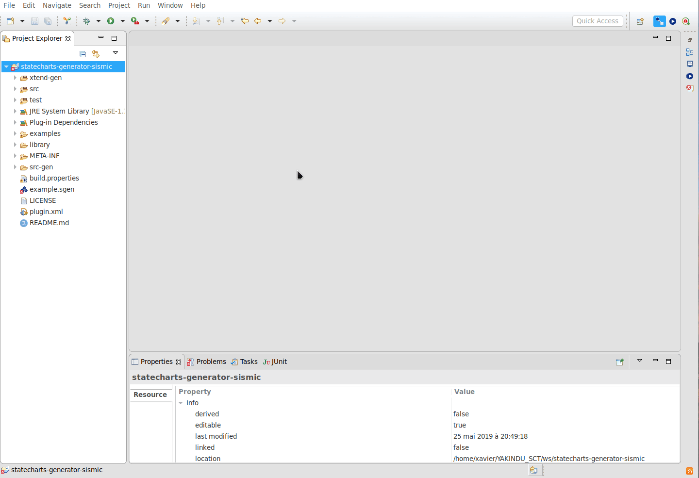

# Génération de statecharts pour la librarie Sismic à partir des statecharts de Yakindu Statecharts Tools
Ce projet a été réalisé dans le cadre de mon projet de première année de Master en Sciences Informatiques à l'UMONS et a comme objectif de générer un statechart créé avec le logiciel Yakindu (fichier avec l'extension *sct*) en un statechart interprétable par une librarie Python, nommée Sismic.

## Sismic
Sismic est une librairie Python, créée et maintenue principalement par le Dr. Alexandre Decan. Cette librairie est disponible en [open source](https://github.com/AlexandreDecan/sismic) et sa [documentation](https://sismic.readthedocs.io/en/latest/) est disponible en anglais.

## Comment installer le générateur ?
### Pré-requis
Avoir installé les logiciels suivants :
 - Java 8 ou plus
 - Yakindu Statechart Tools

### Installation
Vous pouvez installer le générateur en clonant ce répertoire.

## Comment utiliser l'outil ?
Il faut que vous importiez l'outil comme projet dans le logiciel Yakindu Statechart Tools et que vous créiez ou importiez vos statechart dans le projet.

Vous avez ensuite 2 possibilités :
 - Utiliser ou bien copier le modèle du générateur du projet nommé [example.sgen](example.sgen) en remplaçant [nameStatechart] (en enlevant également les crochets) par le nom de votre Statechart.

 - Créer un nouveau modèle de générateur en cliquant à la racine du projet > New... > Code Model generator
    vous pourrez ensuite nommé comme vous le souhaitez.

Une fois le modèle sauvegardé, le générateur créera deux fichiers dans le dossier src-gen. Le premier fichier est un fichier YAML contenant le statechart généré pour Sismic et le second est un fichier Python, contenant un début d'interprétation du statechart généré en important la librairie Sismic.